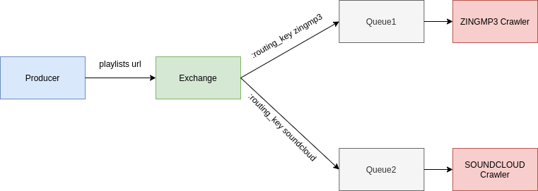

# TOOL CRAWL AND DOWNLOAD MUSIC FROM ZINGMP3, SOUNDCLOUD



## How to run

Download rabbitmq:

```sh
$ sudo apt install rabbitmq-server
```
Install dependances:

```sh
$ pip install -r requirements.txt
```

Start zingmp3Crawler
```sh
$ python zingmp3Crawler/consumer.py
```

In other teminal, start soundcloudCrawler
```sh
$ python soundcloudCrawler/consumer.py
```

In other terminal, start produer to push list music playlist to queue
```sh
$ python producer/producer.py
```

**NOTE**

+ playlists download writes in file playlists.txt

+ You can run with multiple zingmp3 or soundcloud crawler to increase performance and download speed

